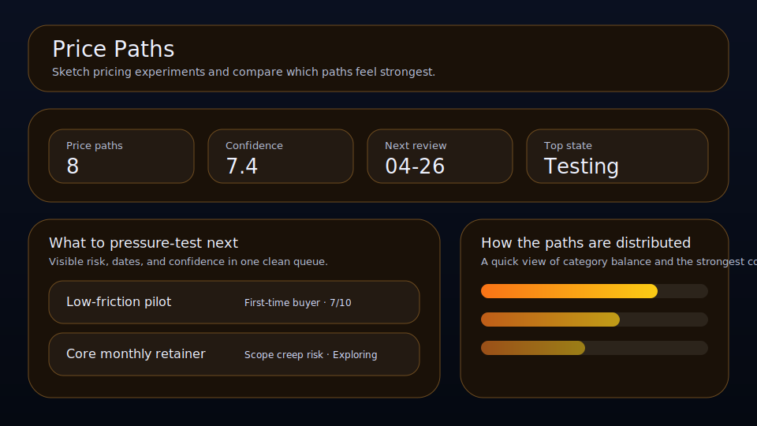

# Price Paths

Sketch pricing experiments and compare which paths feel strongest.



Price Paths is a local-first workspace for founders, operators, and solo builders who want a cleaner way to manage price paths. It keeps confidence, audience, risk, and review timing visible so the right things move forward with less drift.

## What it does

- ranks price paths by leverage, confidence, timing, and friction
- tracks **audience**, **risk**, **review date**, and **confidence** for each price path
- highlights the best current bet, the next review slot, and the strongest signal on the board
- renders a dedicated queue plus a category mix snapshot beneath the main board
- saves locally in the browser with JSON import/export backups
- quick action: **Start test**
- quick action: **Raise confidence**
- quick action: **Drop path**

## Why it feels different

Price Paths is not just a generic list. It is shaped around the real workflow behind price paths, so the board helps you decide what matters next instead of simply storing records.

## Quick start

```bash
git clone https://github.com/get2salam/price-paths.git
cd price-paths
python -m http.server 8000
```

Then open <http://localhost:8000>.

## Keyboard shortcuts

- `N` creates a new price path
- `/` focuses the search box

## Privacy

Everything stays in your browser unless you export a JSON backup.

## License

MIT
